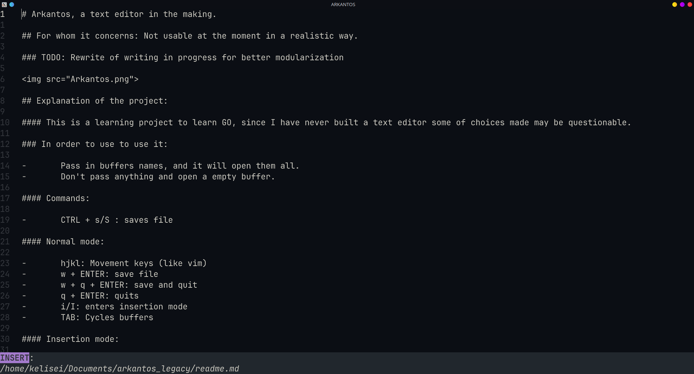

# Arkantos, a text editor in the making.
## For whom it concerns: Not usable at the moment in a realistic way.
### TODO: Rewrite of writing in progress for better modularization

## Explanation of the project:

#### This is a learning project to learn GO, since I have never built a text editor some of choices made may be questionable.

#### Commands:

-       CTRL + s/S : saves file

#### Normal mode:
-       hjkl: Movement keys (like vim)
-       w/W + ENTER: save file
-       w/W + q/Q + ENTER: save and quit
-       q/Q + ENTER: quits
-       i/I: enters insertion mode

#### Insertion mode:
-       ESC: enters normal mode
-       Else it behaves like a normal text editor
-       TODO: copy and paste

#### Sources:
<a>https://github.com/gen2brain/raylib-go</a>